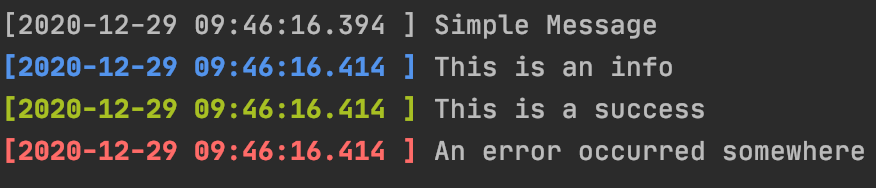

# PrettyPrinter
## Simple printer
* `print(String message)`
* `printInfo(String message)`
* `printSuccess(String message)`
* `printError(String message)`

## With decorator
* `printDecorator(String message)`
* `printInfoDecorator(String message)`
* `printSuccessDecorator(String message)`
* `printErrorDecorator(String message)`

## Using the builder
* `builder(PrinterType type, String message, String decorator)`

* PrinterType (Enum):
  * STANDARD
  * INFO
  * SUCCESS
  * ERROR
* decorator
  * the string that will surcharge the standard decorator, if empty or null will be `------`
  
